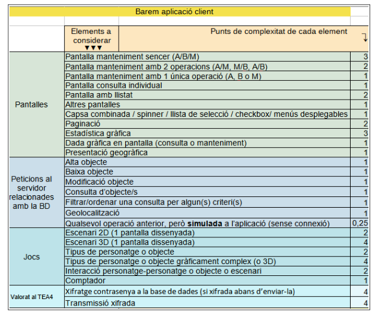

## Requisits tècnics del projecte.

En base a les competències expressades al cicle, el projecte ha de complir els següents requisits:

• Ha de tenir una arquitectura client-servidor. El servidor ha de proporcionar serveis per l’accés als elements compartits (normalment, per l’accés a la base de dades del servidor). Aquests serveis
seran utilitzats per les aplicacions client.

• Per tant, haurà de contenir dues aplicacions client i una aplicació servidor. A més:

    ◦ Una de les aplicacions serà per a dispositius mòbils i l’altra serà una aplicació d’escriptori.

    ◦ Les aplicacions client han de ser independents. Sí que es pot, però, compartir biblioteques,
    sempre que en quedi clara l’autoria.

    ◦ Si, excepcionalment, el grup només té dos membres, només caldrà fer una de les dues aplicacions client.

• Ha d'utilitzar-se una base de dades en la implementació.

• Cap de les aplicacions ha de ser de tipus web. Sí que és permès (però no és obligatori) utilitzar
serveis web (web services) per a la comunicació entre les aplicacions.

• Ha de permetre realitzar gestió d'usuaris.

• Ha de suportar, com a mínim, dos rols: administrador i usuari "normal". L'administrador ha de disposar d'una interfície amb una part específica que inclogui un panell de control propi d'administració.

• Les comunicacions seran xifrades i les contrasenyes s’emmagatzemaran també xifrades o transformades amb una funció resum (hash) a la base de dades. Aquestes característiques es valoraran al TEA4, encara que poden estar implementades abans.

• Per últim, és molt recomanable, però no obligatori, que, quan s'hagi de treballar amb una llista que pugui ser molt (per exemple: llista de tots els articles o tots els clients en empreses que en puguin tenir centenars o milers):

    • Es proporcionin opcions de filtratge a les dades perquè l’usuari pugui localitzar ràpidament l'element que es cerca.

    • Es dissenyin les crides al servidor per evitar que aquest sempre hagi de recuperar i enviar totes les dades als clients, quan només se'n visualitzarà una petita part. Estratègies possibles són: que el servidor proporcioni unes crides que creïn consultes de només una part del resultat, crides que permetin recórrer una consulta creada en una crida anterior (anar a l’anterior, al següent, etc.) i, al final, tancar aquesta consulta. El servidor, quan hagi de respondre a peticions com aquestes, pot utilitzar, si l’SGBD ho permet, consultes amb clàusules de paginació del resultat; per exemple, si el servidor treballa amb SQL:2011 o superior, podrà utilitzar dins dels SELECT les clàusules de paginació OFFSET... ROWS o FETCH...ROWS.
    El projecte pot contenir altres característiques.

Al cas que vulgueu implementar un joc autònom, la part d'administració podria encarregar-se de dur el control dels jugadors, un rànquing de puntuacions dels usuaris dels jocs, fer estadístiques de les seves ubicacions, centralitzar dades del joc (per exemple, laberints)... Les puntuacions s'emmagatzemarien automàticament al servidor si hi ha connexió. Els rànquings podrien consultar-se bé des del propi joc, bé des d'una aplicació autònoma.

Si opteu per fer un projecte de control d’algun tipus de dispositiu o altra mena de maquinari, és necessari que es pugui comprovar el seu funcionament bé amb el maquinari real, bé amb un simulador preexistent.

## Requisits de volum

• El diagrama de classes persistents que correspongui a la base de dades del servidor ha de contenir un mínim de 5 classes persistents amb manteniment associat, de manera que la gran majoria d’elles participi en alguna relació.

• Al TEA2 cal que l’increment reculli com a mínim les funcions de login i logout tant als clients com al servidor i tenint en compte el tipus d’usuari. No es demana res més perquè es considera que en aquest primer TEA és important adaptar-se a la metodologia i eines que utilitzareu.

• A partir del TEA3 en cada sprint cal que realitzeu un increment per valor de 30 punts com a mínim, segons el barem que s’indica més avall. Fixeu-vos són diferents els barems de l’aplicació client i de l’aplicació servidor. Tingueu en compte també que una mateixa pantalla (aplicació client) o crida (aplicació servidor) pot contenir més d’un element del barem. Per exemple, una pantalla o crida pot fer una consulta sobre una classe i permetre l’ordenació per un determinat criteri; aquesta pantalla o crida sumaria els punts corresponents a una consulta sobre una classe i a un criteri d’ordenació o filtratge (3 + 2 al cas d’una aplicació client, 3 +3 al cas d’una aplicació servidor). Un altre exemple és una pantalla de consulta mestre/detall (per exemple, factures i línies de factura): comptaria com una consulta individual (de la capçalera) i com a un llistat (de les línies de factura).

• El document DAM_M13_QuantificacioVolum.ods, a la carpeta "Recursos per als sprints", us ajudarà a calcular els punts que porteu realitzats.

• Al cas de projectes on sigui complicat aplicar aquests barems, cal acordar un altre amb el professorat.

• Trobareu els barems a les dues pàgines següents:

    
