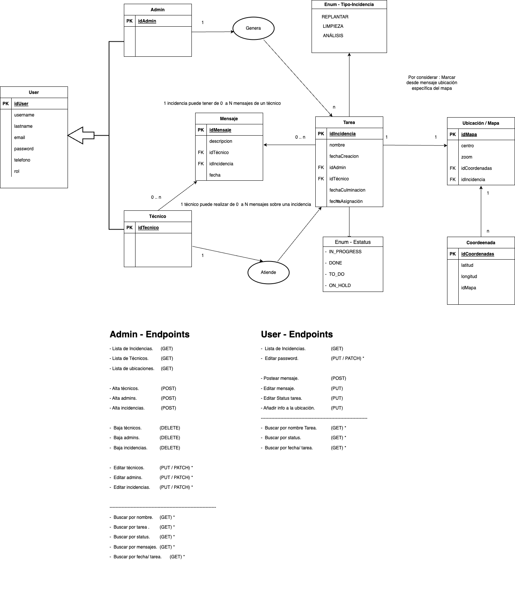

# <h1 style="text-align: center; color : blueviolet; font-family : Courier New;">Final Project DAM - RESEED</h1>

<div>

<h2  style="font-family : Courier New; font-size : 25px;">Team Members :</h2>

- Isabel Calzadilla.
- Eduard Falcón.
- David Farrel.

<!-- TOP ANCHOR WITH ID TO CALL -->
<a href="#top" id="top"></a>

<h2 style="font-family : Courier New; font-size : 25px;">Menu : </h2>

<details>
  <summary>Table of Contents</summary>
  <ol>
    <li>
      <a href="#sintesis">About the Project</a>
      <ul>
        <li><a href="#tecnologias">Built With</a></li>
      </ul>
    </li>
    <li>
      <a href="#aplicacion">Getting Started</a>
      <ul>
        <li><a href="#prerequisites">Prerequisites</a></li>
        <li><a href="#installation">Installation</a></li>
      </ul>
    </li>
    <li><a href="#usage">Usage</a></li>
    <li><a href="#modelo1">Use Case Diagram</a></li>
    <li><a href="#modelo2">Class Diagram</a></li>
  </ol>
</details>

<h2 style="font-family : Courier New; font-size : 25px;" id="sintesis">About the Project</h2>

<br />
<div align="center">
  <a href="https://github.com/LTRIPLEY27/DAM_M13_Projects/new/main/DEFINITION.md">
    
  </a>
  <p align="center">
    IOC Requisites of Project
    <br />
    <a href="https://github.com/LTRIPLEY27/DAM_M13_Projects/new/main/DEFINITION.md"><strong>Explore the docs »</strong></a>
</div>


<p align="right">(<a href="#top" >back to top</a>)</p>

<h2 style="font-family : Courier New; font-size : 25px;" id="tecnologias">Tools</h2>


<details>
  <ol>
    <li>
      <a href="#">Backend :</a>
      <ul>
        <li>Java 17.</li>
      </ul>
    </li>
    <li>
      <a href="#">Visual :</a>
      <ul>
        <li>Desktop : Visual Studio</li>
        <li>Mobile : Android Studio</li>
      </ul>
    </li>
    <li>
      <a href="#">Sprints :</a>
      <ul>
        <li>GitHub</li>
        <li>TAIGA</li>
      </ul>
    </li>
  </ol>
</details>


<p align="right">(<a href="#top">back to top</a>)</p>


<h2 style="font-family : Courier New; font-size : 25px;" id="aplicacion">Install : </h2>

### Prerequisites

* IDE Java compatible

### Installation

1. Clone the repo
    ```sh
   git clone https://github.com/LTRIPLEY27/DAM_M13_Projects/new/main
   ```
2. Install maven packages

3. Start the app

4. ?????

5. Profit

<p align="right">(<a href="#top" >back to top</a>)</p>


<
### Available Operations :




<p align="right">(<a href="#top" >back to top</a>)</p>

<h2 style="font-family : Courier New; font-size : 25px;" id="modelo2">Class Diagram</h2>

### The Class in the Application are:

#### Basic Instances

- Admin.


#### Enums

- Tipo_Tarea-.


<p align="right">(<a href="#top">back to top</a>)</p>

<h2 style="font-family : Courier New; font-size : 25px;" id="modelo3">Arch Diagram</h2>

#### Logic of Bussiness

##### Services

- Menu.


##### Controllers

- Admin.
- Tecnico.

##### Interfaces

- DataSource.


<p align="right">(<a href="#top">back to top</a>)</p>

</div>
